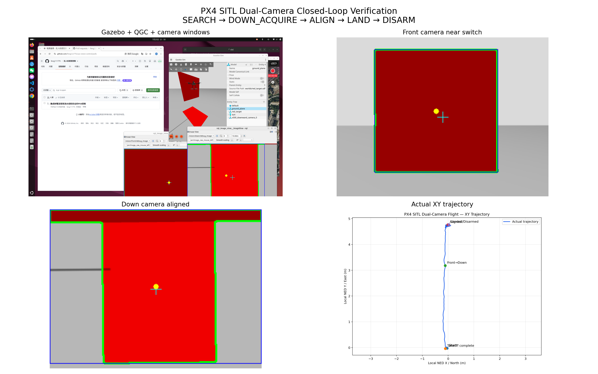
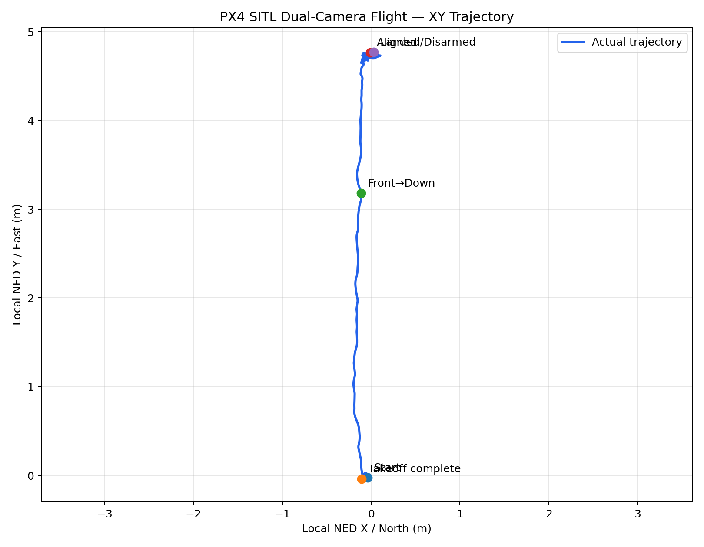
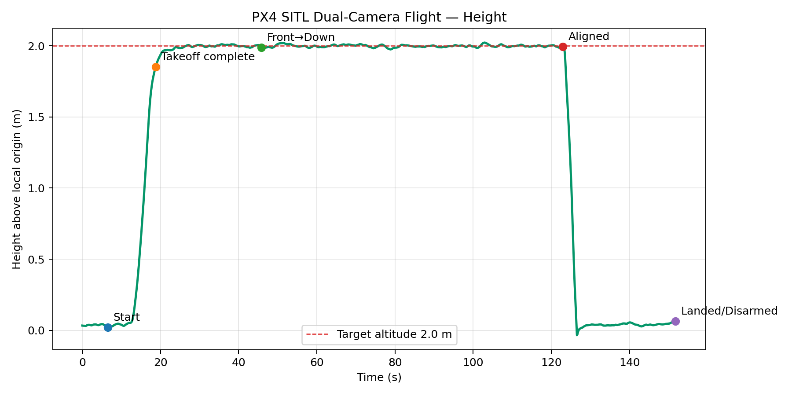
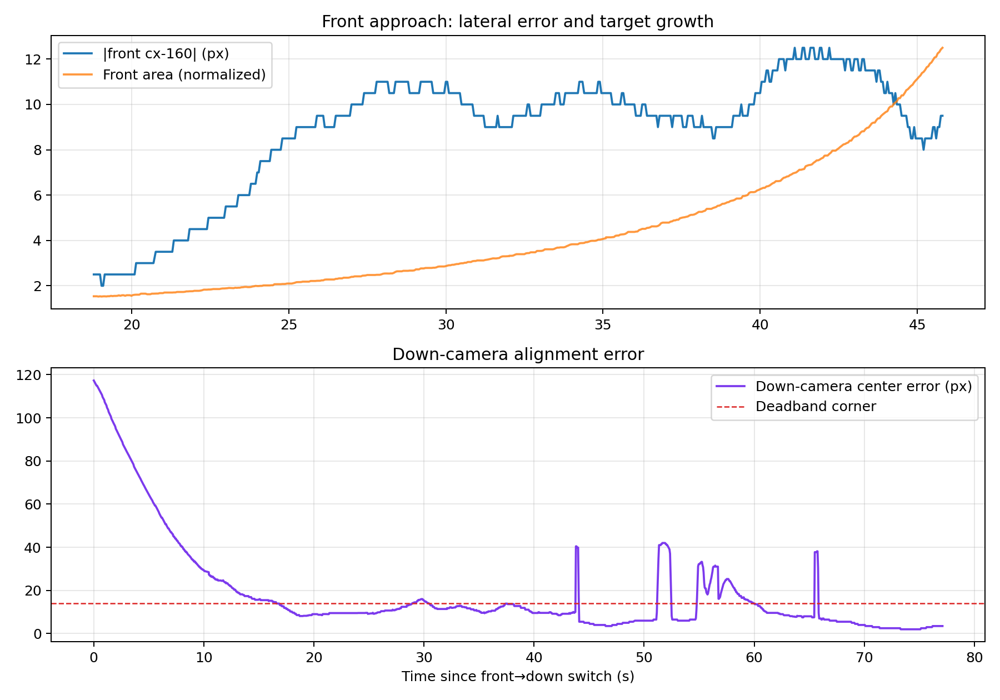

# UAV Vision Control

ROS 2 无人机视觉控制工程，包含 Raspberry Pi/OpenMV 视觉输入、目标检测与滤波、
视觉伺服，以及经过 PX4 SITL 实飞验证的前视/下视双摄闭环。

> 安全说明：自动解锁只允许用于本机 PX4 SITL。所有正式启动入口默认
> `enable_offboard=false`、`enable_auto_arm=false`。真实飞行前必须重新完成
> 硬件、坐标、参数、人工接管和 failsafe 验证。

## 已验证状态

最终验证环境：

- Ubuntu 24.04
- ROS 2 Jazzy
- PX4 v1.17.0 (`d6f12ad1c4`)
- Gazebo Sim 8.11.0
- Micro XRCE-DDS Agent UDP 8888
- QGroundControl AppImage

使用 `red_target` 世界和 `gz_x500_downward_camera` 机型，实际完成：

```text
WAITING → PRESTREAM → TAKEOFF → VISION_CONTROL
→ SEARCH/front → DOWN_ACQUIRE/front → ALIGN/down
→ LAND → DISARM
```

最终一轮没有发生 PX4 failsafe，最大高度 2.023 m，下视中心误差从
117.3 px 收敛到 3.5 px，最后由 PX4 正常检测落地并自动上锁。



详细指标与轨迹见 [SITL 验证记录](docs/verification/README.md)。

## 目录

```text
.
├── docs/
│   ├── architecture.md
│   ├── developer_notes.md
│   └── verification/             # 小型验证图片和指标
├── openmv_h7plus/                # OpenMV H7 Plus 程序
├── simulation/
│   ├── px4_overlay/              # 保留 PX4 原始相对路径的模型、世界和 airframe
│   └── scripts/                  # 安全安装 overlay 的脚本
└── src/
    ├── pi_camera_vision/         # Raspberry Pi/USB/图片/视频视觉输入
    ├── uav_vision/               # 双摄检测、选择、滤波和视觉伺服
    └── uav_control/              # PX4 状态和正式 Offboard 控制器
```

## 控制链

双摄 SITL：

```text
Gazebo front camera ─→ front detector ─┐
                                      ├→ camera_selector_node
Gazebo down camera  ─→ down detector ─┘        │
                                               ▼
                                     target_filter_node
                                               │
                                               ▼
                                      visual_servo_node
                                         (ROS FLU)
                                               │
                                               ▼
                              vision_offboard_controller
                                         (PX4 NED)
                                               │
                                               ▼
                                            PX4 SITL
```

相机选择状态：

- `SEARCH`：前视相机居中并以受限速度接近目标。
- `DOWN_ACQUIRE`：前视目标达到面积或尺寸阈值后，等待下视连续有效帧。
- `ALIGN`：只使用下视检测进行二维目标对准。
- 检测或相机来源超时后立即输出零水平速度。

`vision_offboard_controller` 是正式且唯一的 PX4 控制发布者。它负责：

- `WAITING → PRESTREAM → TAKEOFF → VISION_CONTROL`；
- ROS FLU 机体速度到 PX4 NED 的航向旋转；
- 20 Hz Offboard 心跳和速度设定值；
- 高度闭环、水平与垂直限速；
- PX4 状态、本地位置、视觉输入超时保护；
- FAILSAFE 时单次请求正常降落并停止 Offboard 输出。

`src/uav_control/uav_control/offboard_control.py` 仅为早期通信测试节点，不得作为
正式飞行入口，也没有被双摄 launch 启动。

## 团队分工与代码边界

- 视觉与算法位于 `uav_vision`：相机检测、选择器、滤波和视觉伺服。
- 飞控接口与安全状态机位于 `uav_control`。
- `vision_offboard_controller.py` 是当前唯一正式联调入口。
- `offboard_control.py` 仅保留为旧通信测试程序。
- `main` 由团队共同维护；个人开发必须使用独立分支和 Pull Request。
- 不应把比赛任务规划继续堆入底层飞控接口；任务完成判定应由后续独立任务层实现。

## 主要话题

| 话题 | 类型 | 说明 |
| --- | --- | --- |
| `/camera/front/image_raw` | `sensor_msgs/msg/Image` | 前视 Gazebo 图像 |
| `/camera/down/image_raw` | `sensor_msgs/msg/Image` | 下视 Gazebo 图像 |
| `/vision/front/detection` | `std_msgs/msg/Float32MultiArray` | 前视检测 |
| `/vision/down/detection` | `std_msgs/msg/Float32MultiArray` | 下视检测 |
| `/vision/selected_camera` | `std_msgs/msg/String` | `front` 或 `down` |
| `/vision/selected_detection` | `std_msgs/msg/Float32MultiArray` | 唯一选中检测 |
| `/control/vision_velocity` | `geometry_msgs/msg/TwistStamped` | FLU 水平速度 |
| `/fmu/out/vehicle_local_position` | `px4_msgs/msg/VehicleLocalPosition` | PX4 v1.16 实际本地位置（无 `_v1`） |
| `/fmu/out/vehicle_status_v1` | `px4_msgs/msg/VehicleStatus` | PX4 状态 |
| `/fmu/in/offboard_control_mode` | `px4_msgs/msg/OffboardControlMode` | Offboard 心跳 |
| `/fmu/in/trajectory_setpoint` | `px4_msgs/msg/TrajectorySetpoint` | NED 速度设定值 |
| `/fmu/in/vehicle_command` | `px4_msgs/msg/VehicleCommand` | 模式/解锁/降落命令 |

检测数组格式：

```text
[valid, cx, cy, width, height, area, confidence]
```

## 构建

```bash
cd /path/to/uav-vision-control
source /opt/ros/jazzy/setup.bash
rosdep install --from-paths src --ignore-src -r -y
colcon build --symlink-install
source install/setup.bash
```

仓库默认忽略 `src/px4_msgs`。需要检出与 PX4 v1.17 匹配的 `px4_msgs`，
或从兼容的已构建工作空间加载它。

## 安装 PX4 双摄仿真资源

仓库保留了最终飞行实际使用的 PX4 资源，而不是旧的
`x500_dual_camera/dual_camera_red_target` 组合。

```bash
./simulation/scripts/install_px4_overlay.sh \
  /absolute/path/to/PX4-Autopilot
```

脚本安装：

- `Tools/simulation/gz/models/x500_downward_camera`
- `Tools/simulation/gz/worlds/red_target.sdf`
- `ROMFS/.../airframes/4022_gz_x500_downward_camera`
- airframe 的 CMake 列表项（不存在时才添加）

安装后构建 PX4 SITL：

```bash
cd /absolute/path/to/PX4-Autopilot
make px4_sitl_default
```

## 安全启动顺序

### 1. DDS Agent

```bash
MicroXRCEAgent udp4 -p 8888
```

### 2. PX4 SITL 与 Gazebo GUI

```bash
cd /absolute/path/to/PX4-Autopilot
PX4_GZ_WORLD=red_target make px4_sitl gz_x500_downward_camera
```

### 3. QGroundControl

```bash
~/QGroundControl-x86_64.AppImage
```

等待 PX4 控制台出现 `Ready for takeoff!`。不得通过强制
解锁或关闭关键安全检查绕过预检。

### 4. 默认安全监视

```bash
cd /path/to/uav-vision-control
source /opt/ros/jazzy/setup.bash
source install/setup.bash
ros2 launch uav_vision dual_camera_simulation.launch.py
```

默认不会发布 PX4 控制、不会切换 Offboard、不会解锁。

### 5. SITL 自动闭环

仅在确认连接对象是本机 SITL、`pre_flight_checks_pass=true` 且
`failsafe=false` 后：

```bash
ros2 launch uav_vision dual_camera_simulation.launch.py \
  selector_mode:=auto \
  enable_offboard:=true \
  enable_auto_arm:=true
```

当前控制器在目标对准后保持目标高度。完成验证后应通过 PX4/QGC 请求正常 LAND，
待 `Landing detected` 和自动上锁后再停止 launch、PX4、Gazebo 与 Agent。

## 图像窗口

```bash
ros2 run rqt_image_view rqt_image_view /vision/front/debug_image
ros2 run rqt_image_view rqt_image_view /vision/down/debug_image
```

两个命令应在不同终端运行。

## 启动前安全检查

正式启用 SITL 自动控制前逐项确认：

```bash
ls -l /dev/ttyACM* /dev/ttyUSB* 2>/dev/null
ros2 node list
ros2 topic echo /fmu/out/vehicle_status_v1 --once
```

- 没有连接真实 Pixhawk；若存在真实飞控，先隔离它。
- QGroundControl 只连接本机 SITL。
- `pre_flight_checks_pass=true`、`failsafe=false`。
- Gazebo 中只有一架无人机。
- `/vision_offboard_controller` 只有一个实例。
- `offboard_control.py` 没有运行。
- 前视和下视图像都持续更新。
- 默认观察阶段无人机保持未解锁。

## 参数

以下值来自 `dual_camera_simulation.yaml` 和 launch 实际默认值：

| 参数 | 默认值 | 说明 |
| --- | ---: | --- |
| `simulation_mode` | `true`（该 SITL launch 强制覆盖） | 允许 SITL 专用行为 |
| `enable_offboard` | `false` | 是否发布 PX4 Offboard 控制 |
| `enable_auto_arm` | `false` | 是否允许 SITL 自动解锁 |
| `selector_mode` | `auto` | `front`、`down` 或自动选择 |
| `target_altitude` | `2.0` m | 起飞目标高度 |
| `max_xy_speed` | `0.3` m/s | PX4 水平速度总限幅 |
| `max_z_speed` | `0.5` m/s | PX4 垂直速度限幅 |
| `front_approach_velocity` | `0.12` m/s | 前视有效时接近速度 |
| `visual_servo.max_velocity` | `0.15` m/s | 视觉伺服单轴限幅 |
| `vision_timeout` | `0.3` s | 控制器视觉速度超时 |
| `stale_timeout` | `0.3` s | 视觉伺服检测超时 |
| `source_timeout` | `0.3` s | 相机选择器来源超时 |
| `camera_source_timeout` | `0.3` s | 当前相机标签超时 |
| `px4_status_timeout` | `1.5` s | PX4 状态超时 |
| `local_position_timeout` | `0.5` s | PX4 本地位置超时 |
| `front_area_ratio_threshold` | `0.0488` | 前视目标面积/画面面积阈值 |
| `front_width_ratio_threshold` | `0.4375` | 前视目标宽度/画面宽度阈值 |
| `front_height_ratio_threshold` | `0.5833` | 前视目标高度/画面高度阈值 |
| `front_confirm_frames` | `3` | 前视接近连续确认帧 |
| `down_confirm_frames` | `3` | 下视有效连续确认帧 |
| `down_hold_frames` | `2` | 下视短时丢失保持帧 |
| `down_lost_frames` | `5` | 下视返回 SEARCH 的丢失帧 |
| `switch_cooldown` | `2.0` s | 下视失败后的重试冷却 |

launch 的 `enable_offboard` 和 `enable_auto_arm` 默认值必须保持为 `false`。

## 状态机

飞控状态：

```text
WAITING → PRESTREAM → TAKEOFF → VISION_CONTROL
                              ├→ EXTERNAL_CONTROL
                              └→ FAILSAFE → PX4 LAND
```

- `WAITING`：等待新鲜且有效的 PX4 状态和本地位置。
- `PRESTREAM`：发布 20 Hz Offboard 心跳与零速度预流，然后请求 Offboard。
- `TAKEOFF`：只进行高度闭环，不使用水平视觉速度。
- `VISION_CONTROL`：保持高度并应用视觉水平速度。
- `EXTERNAL_CONTROL`：曾进入 OFFBOARD 后 PX4 切到任意其他模式，永久停止
  本次进程的 Offboard 心跳和设定值，不重新抢回模式。
- `FAILSAFE`：单次请求 PX4 正常 LAND，停止继续发布 Offboard。

相机状态：

```text
SEARCH/front → DOWN_ACQUIRE/front → ALIGN/down
```

当前没有任务完成自动判定状态；最终验证在稳定 ALIGN 后由 PX4 控制台请求正常
LAND。后续若增加自动任务降落，应在独立任务层实现，不能破坏底层安全状态机。

第一次真机红目标测试使用独立的
[`red_target_hardware.yaml`](src/uav_vision/config/red_target_hardware.yaml)
和 `red_target_hardware.launch.py`，不要复用 SITL YAML。安全监视命令：

```bash
ros2 launch uav_vision red_target_hardware.launch.py
```

确认两路检测、PX4 状态和人工模式切换均正常后，才显式启用控制：

```bash
ros2 launch uav_vision red_target_hardware.launch.py enable_offboard:=true
```

真机 launch 强制 `simulation_mode=false`、`enable_auto_arm=false`；稳定 ALIGN
后只保持 0.8 m 高度，必须由遥控器或 QGroundControl 请求 LAND。

## Raspberry Pi 与 OpenMV

- Raspberry Pi 摄像头流程见
  [`src/pi_camera_vision/README.md`](src/pi_camera_vision/README.md)。
- OpenMV H7 Plus 程序与串口协议见
  [`openmv_h7plus/README.md`](openmv_h7plus/README.md)。
- H7、Pi Camera 与 Gazebo 检测源不能同时向同一正式检测链发布。

## 测试

```bash
source /opt/ros/jazzy/setup.bash
colcon build --packages-select uav_control uav_vision --symlink-install
source install/setup.bash
colcon test --packages-select uav_control uav_vision
colcon test-result --verbose
```

最终验证结果：

```text
98 tests
0 errors
0 failures
1 skipped (copyright template)
```

## 最终飞行数据

- 最大高度：2.023 m
- 前视面积：4171 → 34205.5 px²
- front→down 位置：(-0.112, 3.179, -1.989) m
- 下视中心误差：117.3 → 3.5 px
- 最终对准位置：(-0.011, 4.765, -1.995) m
- 全程：`failsafe=false`
- 结束：`Landing detected`、`Disarmed by landing`







## 真机部署

真机验证尚未完成。不得在真实飞行器上直接启用 `enable_auto_arm=true`。

计划使用 Pixhawk 6C 和 Raspberry Pi 4B 时，必须重新检查：

- PX4 与 `px4_msgs` 版本；
- XRCE-DDS 或串口连接；
- FLU/NED 坐标与 heading；
- 两个相机的安装方向、视场和曝光；
- 解锁权限、地理围栏、急停与人工接管；
- 无桨台架、低风险系留和分阶段飞行测试。

## 常见问题

### `No connection to the GCS`

先启动 QGroundControl，确认本机 UDP 14550 没有被其他程序占用，等待 PX4 出现
`Ready for takeoff!`。

### `pre_flight_checks_pass=false`

读取 PX4 控制台和 QGC 的完整健康错误。检查模型是否正确生成、仿真时间是否推进、
EKF/传感器是否初始化；不要强制解锁或关闭关键安全检查。

### 没有图像话题

确认机型是 `gz_x500_downward_camera`、世界是 `red_target`，并检查 Gazebo：

```bash
gz topic -l | grep '/camera/'
ros2 topic list | grep '/camera/'
```

### 有图像但没有检测

查看 `/vision/front/debug_image`、`/vision/down/debug_image`，检查 HSV 阈值、
最小面积、目标是否进入视场，以及两个 detector 节点是否存在。

### 卡在 `WAITING`

检查 `/fmu/out/vehicle_local_position` 和 `/fmu/out/vehicle_status_v1` 是否持续
发布，并确认位置、heading 和状态未超时。

### `Offboard signal lost`

确认只有一个控制器，系统负载没有阻塞 ROS executor，20 Hz
`/fmu/in/offboard_control_mode` 与 `/fmu/in/trajectory_setpoint` 持续发布。

### 出现多个控制器

停止旧 `offboard_control.py` 和重复 launch。`ros2 topic info
/fmu/in/vehicle_command --verbose` 应只显示 `vision_offboard_controller` 发布。

### 前视不能切换到下视

观察前视检测面积/宽高是否达到阈值、连续确认帧是否满足，以及下视目标是否已经
进入画面。

### 下视误差不收敛

立即停止水平控制并正常 LAND。根据实际轨迹检查相机姿态、像素方向、FLU→NED
变换和目标几何；不能只凭公式盲目改符号。

## Git 协作

- 不直接在 `main` 上开发。
- 每位成员使用自己的开发分支。
- 修改前后检查 `git status` 和 `git diff`。
- 提交前完成构建和测试。
- 通过 Pull Request 评审后合并。
- 不提交 `build/`、`install/`、`log/`、rosbag、ULog、PX4 编译产物或密钥。

## 安全边界

- 自动解锁门同时要求 `simulation_mode=true`、`enable_offboard=true`、
  `enable_auto_arm=true`。
- 所有启动参数默认关闭 Offboard 和自动解锁。
- 不得在真实飞控上设置 `simulation_mode=true`。
- 不得同时运行第二个 PX4 控制节点。
- 不得使用 `offboard_control.py` 代替正式控制器。
- 输入无效、超时或 PX4 failsafe 时停止水平控制；控制故障请求正常降落。
- 真机飞行仍需完成无桨台架、定位/航向、人工接管、地理围栏和 failsafe 验证。
# 2026 全国大学生电子设计竞赛 D 题视觉链路（第一阶段）

## 第二阶段：统一任务控制器

第二阶段提供两个互相独立的评分任务 `drop`、`dynamic_land`，以及唯一首次上机路径
`hover_test`。流程和安全状态见 `docs/d_task_state_machine.md`。正式控制launch只启动
`mission_controller_node` 与只读 `mission_dashboard_node`，不会启动PX4、Agent、小车
控制或模拟执行机构。

| 输入 | 类型 | 用途 |
|---|---|---|
| `/car/mission_start` | `std_msgs/Bool` | A点启动事件 |
| `/car/progress` | `std_msgs/UInt8` | A/B/C/D/A单调进度 |
| `/uav/safety/ready` | `std_msgs/Bool` | 新鲜真机安全许可 |
| `/uav/mission/reset` | `std_msgs/Bool` | 上锁且非运行态复位 |
| `/uav/touchdown_sensor` | `std_msgs/Bool` | 可选接触输入 |
| 第一阶段两个视觉话题 | `Float32MultiArray` | 原schema顺序不变 |
| `/uav/payload/release_ack` | `std_msgs/Bool` | 执行机构确认 |

输出包括 `/uav/payload/release`、`/uav/mission/state`、`event`、`telemetry`、
`path` 和 `/uav/mission/debug_canvas`。PX4只使用批准的三个 `/fmu/in/` topic与四个
`/fmu/out/` topic。可用 `rqt_image_view /uav/mission/debug_canvas` 查看任务画布，第一
阶段目标画布仍为 `/vision/debug/target_canvas`；RViz添加Path并选择
`/uav/mission/path` 可只读显示轨迹。

无PX4测试使用 `first_flight_hover` 且保持 `enable_control=false`。精确 PX4 v1.16.0
源码位于 `/home/xixi/PX4-Autopilot-1.16.0`；另行启动 PX4 和 Micro XRCE-DDS Agent 后运行
`ros2 launch uav_control d_task_sitl.launch.py mission_mode:=drop` 或
`dynamic_land`。实际启动命令、DDS topic、闭环结果和故障注入见
`docs/sitl_test_report.md`。未来真机必须遵循 `docs/first_flight_checklist.md`，默认配置不能控制或
自动解锁。

当前仍未完成正式同心圆/十字检测、相机标定、真实抛投GPIO、移动平台接触验证和
带桨真机试飞。普通x500地面SITL不证明动态平台摩擦或二次起飞稳定性。

**禁止直接带桨运行本软件。**

唯一基线：Ubuntu 24.04、ROS 2 Jazzy、PX4 Release 1.16.0
（`6ea3539157ca358c70a515878b77077af7d4611d`，`px4_fmu-v6c_default`）、
Micro XRCE-DDS Agent 2.4.3、`px4_msgs release/1.16`。硬件目标为 Pixhawk 6C
Mini、Raspberry Pi 4B 和 OpenMV H7 Plus。

正式链路为 `h7_bridge_node` 或 `fake_h7_node` → `target_filter_node` →
`target_predictor_node` → `landing_error_node` → `vision_dashboard_node`。对应主要话题：
`/vision/h7/detection`、`/vision/h7/filtered_detection`、
`/vision/target/tracked`、`/vision/landing_error`、
`/vision/debug/target_canvas` 和 `/vision/debug/status`。

H7 正式串口协议为：

```text
D_TARGET,valid,cx,cy,outer_diameter_px,inner_diameter_px,angle_rad,confidence
```

默认只接受 `D_TARGET`。`allow_legacy_protocol:=true` 也只接受无歧义的旧
`TARGET,0,0,0,0,0,0,0` 无目标心跳；旧有效检测仍会拒绝，绝不会把
`width,height,area` 解释成内外圆与角度。

构建并以假数据运行：

```bash
source /opt/ros/jazzy/setup.bash
colcon build --symlink-install --packages-select uav_vision
source install/setup.bash
ros2 launch uav_vision d_task_vision.launch.py input_source:=fake
```

连接 H7 时将最后一行改为 `input_source:=h7`。查看画布可运行
`rqt_image_view /vision/debug/target_canvas`；查看地面站友好状态可运行
`ros2 topic echo /vision/debug/status`。同一 launch 只会启动一个原始数据源，且不会
启动 PX4 控制节点。

本阶段只输出像素误差和归一化误差，未伪造焦距或米制误差；尚未实现正式同心圆/
十字检测、相机标定与高度融合、完整 PX4 任务状态机、SITL 闭环或真机飞行。后续
先在 SITL 验证接口与失效保护，再进入带人工安全边界的真机测试；任何启动均不会
在本阶段自动解锁。
